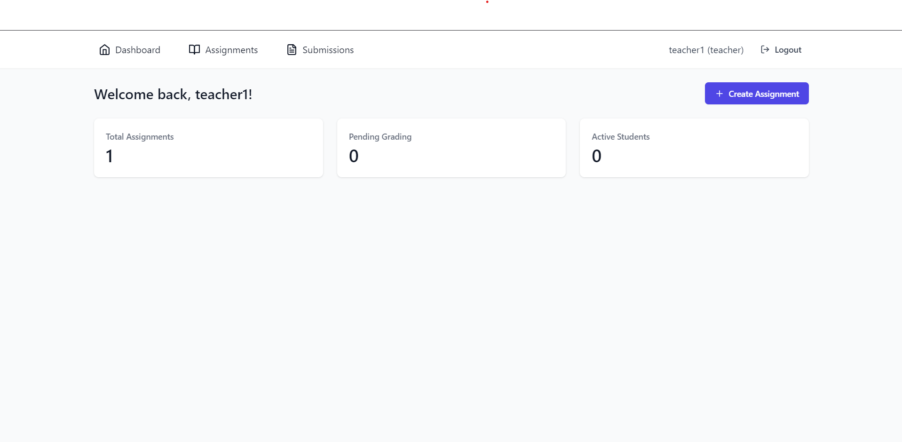
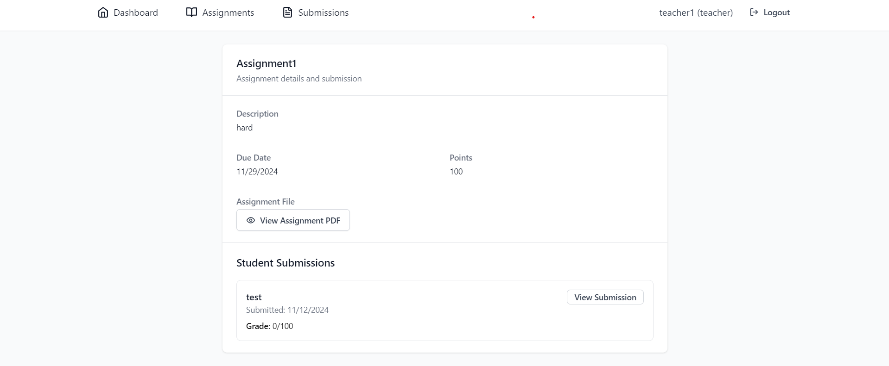

# ERoom - Assignment Management System

A modern, responsive web application for managing educational assignments built with React, TypeScript, and Tailwind CSS.

## Login


## Dashboard



## Assignment Review and Grading



## Features

- 🔐 **User Authentication**
  - Separate login for teachers and students
  - Secure registration system
  - Protected routes

- 👩‍🏫 **Teacher Features**
  - Create and manage assignments
  - View all student submissions
  - Grade assignments and provide feedback
  - Track student progress
  - Dashboard with submission statistics

- 👨‍🎓 **Student Features**
  - View and submit assignments
  - Track submission status
  - View grades and feedback
  - Progress dashboard with statistics
  - Submission streak tracking

- 💻 **Technical Features**
  - Persistent storage using IndexedDB
  - Real-time status updates
  - Responsive design
  - File upload support
  - Modern UI with Tailwind CSS

## Tech Stack

- **Frontend Framework**: React with TypeScript
- **Routing**: React Router v6
- **State Management**: Zustand
- **Storage**: IndexedDB (idb)
- **Styling**: Tailwind CSS
- **Icons**: Lucide React
- **File Handling**: React Dropzone
- **Notifications**: React Hot Toast
- **Build Tool**: Vite

## Getting Started

1. Clone the repository:
   ```bash
   git clone https://github.com/RUPAMLAHA-code/eroom.git
   cd eroom
   ```

2. Install dependencies:
   ```bash
   npm install
   ```

3. Start the development server:
   ```bash
   npm run dev
   ```

4. Open [http://localhost:5173](http://localhost:5173) in your browser

## Project Structure

```
src/
├── components/        # Reusable UI components
├── pages/            # Page components
├── store/            # Zustand store configurations
├── lib/              # Utilities and database operations
├── types/            # TypeScript type definitions
└── main.tsx         # Application entry point
```

## Contributing

1. Fork the repository
2. Create your feature branch (`git checkout -b feature/amazing-feature`)
3. Commit your changes (`git commit -m 'Add some amazing feature'`)
4. Push to the branch (`git push origin feature/amazing-feature`)
5. Open a Pull Request

## License

This project is licensed under the MIT License - see the [LICENSE](LICENSE) file for details.

## Author

**Rupam Laha**
- GitHub: [@RUPAMLAHA-code](https://github.com/RUPAMLAHA-code)

## Acknowledgments

- Icons by [Lucide](https://lucide.dev)
- UI components inspired by [Tailwind UI](https://tailwindui.com)
